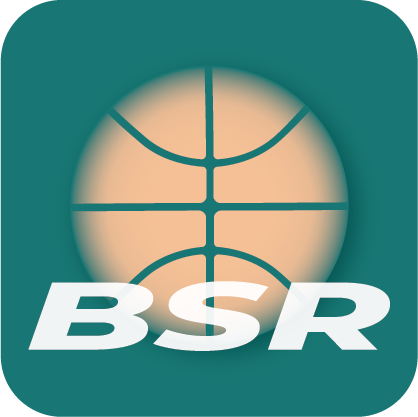

<a id="readme-top"></a>
<!--
*** Thanks for checking out the Best-README-Template. If you have a suggestion
*** that would make this better, please fork the repo and create a pull request
*** or simply open an issue with the tag "enhancement".
*** Don't forget to give the project a star!
*** Thanks again! Now go create something AMAZING! :D
-->


<!-- PROJECT SHIELDS -->

<!-- 
*** I'm using markdown "reference style" links for readability.
*** Reference links are enclosed in brackets [ ] instead of parentheses ( ).
*** See the bottom of this document for the declaration of the reference variables
*** for contributors-url, forks-url, etc. This is an optional, concise syntax you may use.
*** https://www.markdownguide.org/basic-syntax/#reference-style-links

[![Contributors][contributors-shield]][contributors-url]
[![Forks][forks-shield]][forks-url]
[![Stargazers][stars-shield]][stars-url]
[![Issues][issues-shield]][issues-url]
[![MIT License][license-shield]][license-url]
[![LinkedIn][linkedin-shield]][linkedin-url] -->


<!-- PROJECT LOGO -->
<br />
<div align="center">
  <a href="https://github.com/diegogglez/BSR">
    
  </a>

<h3 align="center">BSR</h3>

  <p align="center">
    BSR is a simple app to record your basket shooting practices.
    <br />
    ·
    <a href="https://github.com/diegogglez/BSR/issues">Report Bug</a>
    ·
    <a href="https://github.com/diegogglez/BSR/issues">Request Feature</a>
  </p>
</div>

<div align="center">
  
  <a href="">[](https://play.google.com/store/apps/details?id=com.bsr.basket)</a>
  
</div>


<!-- TABLE OF CONTENTS -->
<details>
  <summary>Table of Contents</summary>
  <ol>
    <li>
      <a href="#about-the-project">About The Project</a>
      <ul>
        <li><a href="#built-with">Built With</a></li>
      </ul>
    </li>
    <li>
      <a href="#getting-started">Getting Started</a>
      <ul>
        <li><a href="#prerequisites">Prerequisites</a></li>
        <li><a href="#installation">Installation</a></li>
      </ul>
    </li>
    <li><a href="#contributing">Contributing</a></li>
    <li><a href="#contact">Contact</a></li>
  </ol>
</details>


<!-- ABOUT THE PROJECT -->
## About The Project

[![Product Name Screen Shot][product-screenshot]](https://github.com/diegogglez/BSR)

This is a basketball practice tracking app based on Stephen Curry's routine. It is built with a simple and intuitive user interface, offering an easy way to log your shooting practices in order to have a timeline of your progress. Use BSR and take your shooting skills to the next level!

<p align="right">(<a href="#readme-top">back to top</a>)</p>


### Built With

* [Angular][Angular-url]
* [Ionic Framework][IonicFramework-url]
* [Capacitor Preferences API][Capacitor-preferences-url]
* [TailwindCSS][Tailwindcss-url]
* [Apexcharts][Apexcharts-url]

<p align="right">(<a href="#readme-top">back to top</a>)</p>


<!-- GETTING STARTED -->
## Getting Started

### Prerequisites

You need to install Node.js, then install the latest Ionic command-line tools in your terminal.
  ```sh
  npm install -g @ionic/cli
  ```
  
 Then you can follow the [Ionic Framework](https://ionicframework.com/) guides to install the native tools for [Android](https://ionicframework.com/docs/developing/android) and [iOS](https://ionicframework.com/docs/developing/ios).
 

### Installation


 If you already have all the tools required, you can install it on your device by running:
 
 #### Android:
 Add Android platform if it doesn't exist:
  ```
  ionic cap add android
  ```
  Build project and sync with capacitor platforms:
  ```
  ionic cap sync
  ```
  Open native Android project in Android Studio:
  ```
  ionic cap open android
  ```
 And then use Android Studio to compile and run.
 
 #### iOS:
 Add iOS platform if it doesn't exist:
  ```
  ionic cap add ios
  ```
  Build project and sync with capacitor platforms:
  ```
  ionic cap sync
  ```
  Open native iOS project in Xcode:
  ```
  ionic cap open ios
  ```
  And then use Xcode to compile and run.

<!-- CONTRIBUTING -->
## Contributing

Contributions are what make the open source community such an amazing place to learn, inspire, and create. Any contributions you make are **greatly appreciated**.

If you have a suggestion that would make this better, please fork the repo and create a pull request. You can also simply open an issue with the tag "enhancement".
Don't forget to give the project a star! Thanks again!

1. Fork the Project
2. Create your Feature Branch (`git checkout -b feature/AmazingFeature`)
3. Commit your Changes (`git commit -m 'Add some AmazingFeature'`)
4. Push to the Branch (`git push origin feature/AmazingFeature`)
5. Open a Pull Request

<p align="right">(<a href="#readme-top">back to top</a>)</p>

<!-- CONTACT -->
## Contact

Diego García - diegomiller7@gmail.com

Project Link: [https://github.com/diegogglez/BSR](https://github.com/diegogglez/BSR)

LinkedIn: [https://www.linkedin.com/in/diego-gglez/](https://www.linkedin.com/in/diego-gglez/)

<p align="right">(<a href="#readme-top">back to top</a>)</p>


<!-- MARKDOWN LINKS & IMAGES -->
<!-- https://www.markdownguide.org/basic-syntax/#reference-style-links -->

[product-screenshot]: readme-imgs/screenshots.png
[Angular-url]: https://angular.io/
[Tailwindcss-url]: https://tailwindcss.com/
[Capacitor-preferences-url]: https://capacitorjs.com/docs/apis/preferences
[IonicFramework-url]: https://ionicframework.com/
[Apexcharts-url]: https://apexcharts.com/

